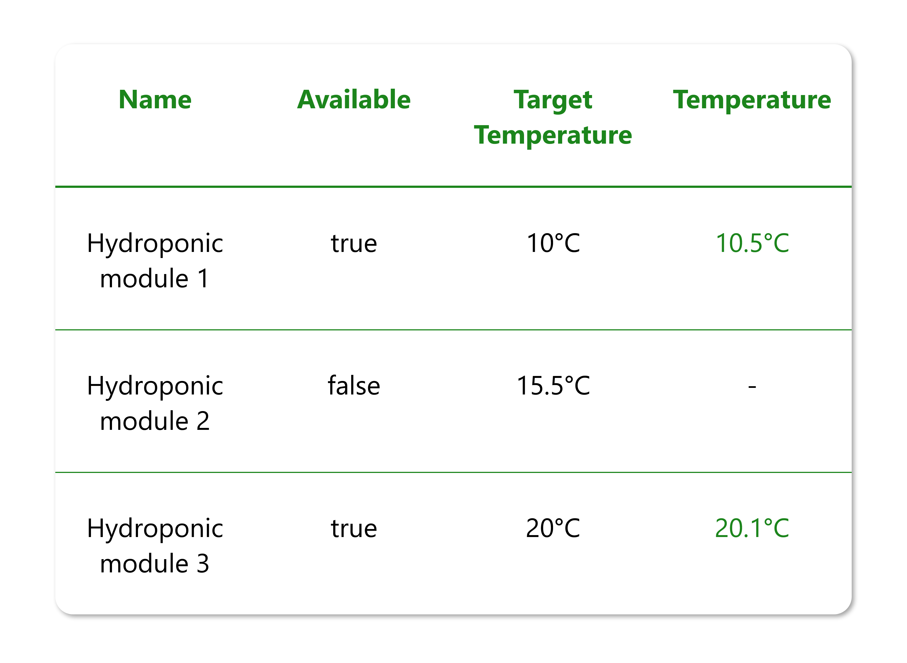
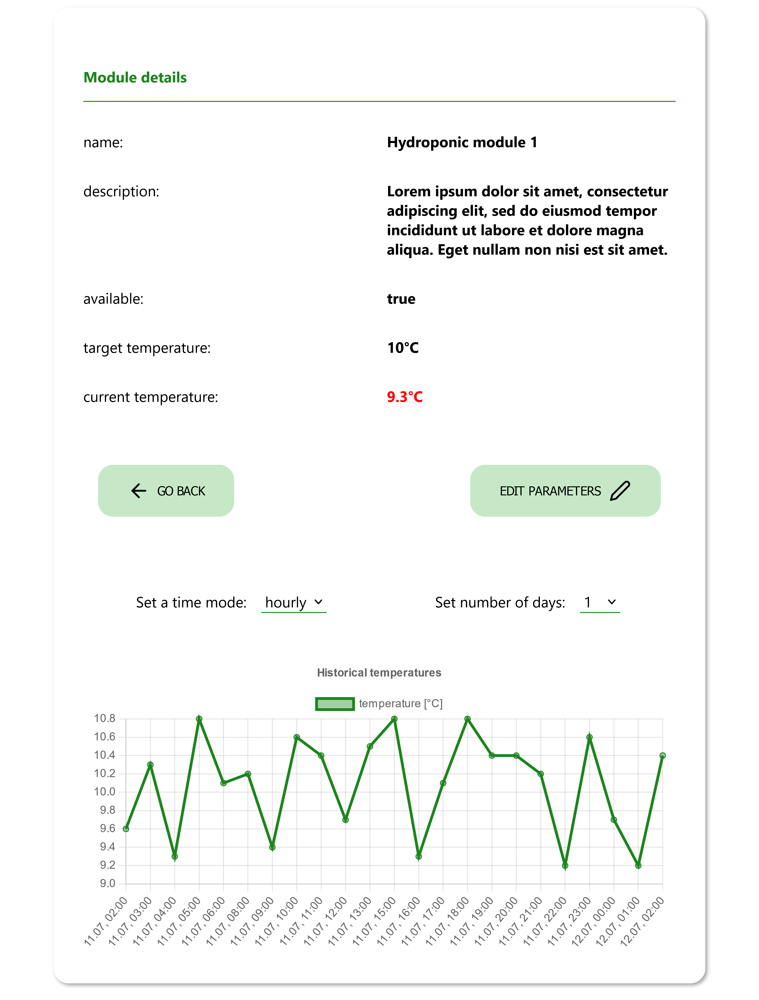

# AquaPonic - Iot Module API

This application is used to manage IoT modules that take measurements of water parameters in aquaponic culture.
This app was created using **Vite + React.js + React Router**.

<p align="center">

</p>

## Table of contents

- [Features](#Features)
- [Technologies](#technologies)
- [Screenshots](#screenshots)

## Features

**1.Module list page**: the main page of the application displays all available modules in the form of a list with their parameters.
**2.Module details page**: after clicking on the appropriate item in the list of all modules, the user is transferred to the details page of the selected module
**3.Ability to edit the module**: on the module details page the user has the possibility to change the module parameters.
-After clicking the button 'EDIT PARAMETERS' the fields with the possibility to edit the parameters name, description, targetTemperature will appear.

- It is not possible to edit an unavailable module.
- The data entered are subject to validation before being sent to the API.
  **4.Display of current temperature value**: The current water temperature measured by the module is displayed on the module list and the module details page together with other parameters.
- The temperature is retrieved from the WebSocket server at localhost:3001.
- The package npm socket.io-client was used to communicate via WebSocket.
- The displayed temperature is updated in real time when a message is received from the WebSocket server.
- If the temperature is within ±0.5°C the targetTemperature, value is displayed in green, otherwise in red.
  **5.Display of historical temperature data**: a chart was added to the module details page with the possibility of viewing historical data for the module.
- The Chart.js library was used to display the chart
- The user can select the time range (1 day, 2 days, 7 days, 10 days, 30 days) and mode ("hourly" or "daily")

## Technologies

<p align="left">
<a href="https://react.dev/"></a>
<a href="https://vitejs.dev/"></a>
<a href="https://developer.mozilla.org/en-US/docs/Web/JavaScript"></a>
<a href="https://developer.mozilla.org/en-US/docs/Web/CSS?retiredLocale=pl"></a>

## Screenshots

### Main page

<p align="center">
  
</p>

### Module details

<p align="center">
  
</p>

### Module edit

<p align="center">
  
</p>

## Installation

To run this project, you must have the following dependencies installed:

- Git (https://git-scm.com)

```bash

git clone https://github.com/lilunia/AquaPonic.git
npm install
npm run dev

```
